# Домашнее задание к занятию «Работа с данными (DDL/DML)» Шелухин Юрий

### Задание 1 
1.1. Поднимите чистый инстанс MySQL версии 8.0+. Можно использовать локальный сервер или контейнер Docker  
1.2. Создайте учётную запись sys_temp.  
1.3. Выполните запрос на получение списка пользователей в базе данных. (скриншот)  
1.4. Дайте все права для пользователя sys_temp.   
1.5. Выполним запрос для выдачи всех прав для пользователя sys_temp. (скриншот)  
1.6. Переподключитесь к базе данных от имени sys_temp.
Для смены типа аутентификации с sha2 используйте запрос: 
```sql
ALTER USER 'sys_test'@'localhost' IDENTIFIED WITH mysql_native_password BY 'password';
```
1.6. По ссылке https://downloads.mysql.com/docs/sakila-db.zip скачайте дамп базы данных.  
1.7. Восстановите дамп в базу данных.  
1.8. При работе в IDE сформируйте ER-диаграмму получившейся базы данных. При работе в командной строке используйте команду для получения всех таблиц базы данных. (скриншот)  

*Результатом работы должны быть скриншоты обозначенных заданий, а также простыня со всеми запросами.*  
---

#### Решение 1.
1.1. Запустим MYSQL в контейнере Docker.    
`~$ docker run --name test-db -p 3306:3306 -e MYSQL_ROOT_PASSWORD=secret -d mysql:latest`   
Dbeaver не соединяется - "Public Key Retrieval is not allowed". Исправим во вкладке Driver Properties параметр "allowPublicKeyRetrieval" на значение "true".    
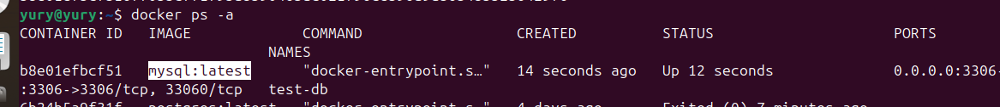     
1.2. Откроем SQL-скрипт.    
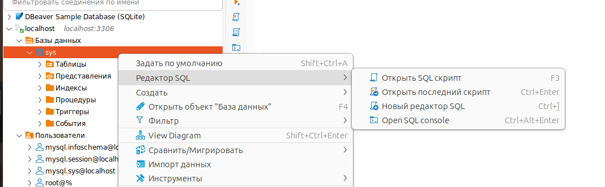  
С помощью SQ-команды создадим пользователя.    
`CREATE USER 'sys_temp'@'%' IDENTIFIED BY 'password';`  Вместо localhost  используем `%`, так как был конфликт при смене аутентификации (localhost root  и sys_temp имели разные ip). В работе этот вариант небезопасен, но для решения подойдет.  
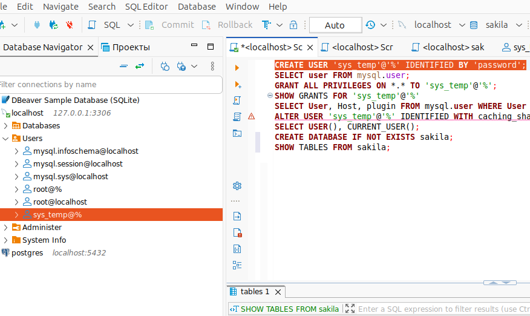      
1.3 Выполним запрос для вывода всех пользователей.      
`SELECT user FROM mysql.user;`  
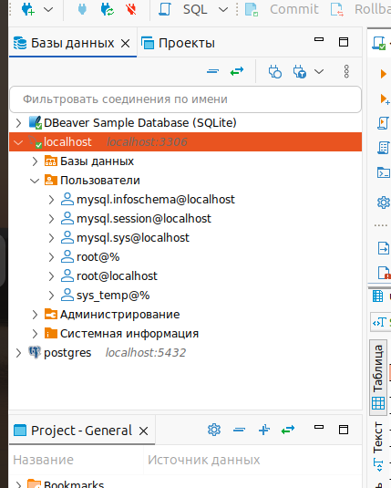    
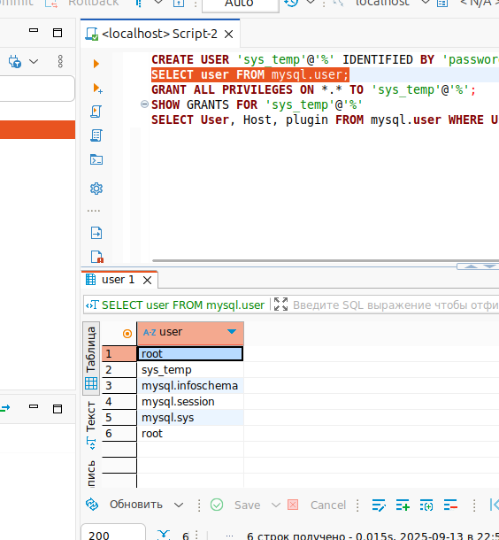   
1.4 Выполним запрос для выдачи всех прав для пользователя sys_temp.   
`GRANT ALL PRIVILEGES ON *.* TO 'sys_temp'@'%';`  
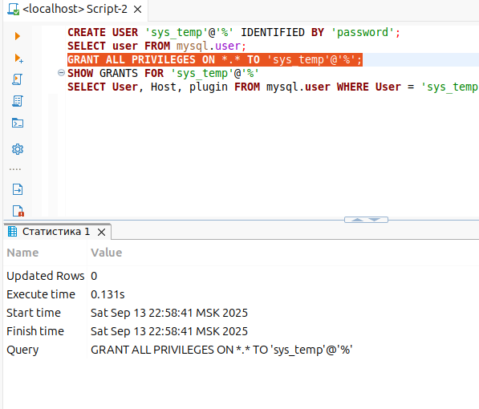  
1.5 Выполним запрос для просмотра прав для пользователя sys_temp.   
`SHOW GRANTS FOR 'sys_temp'@'%';`  
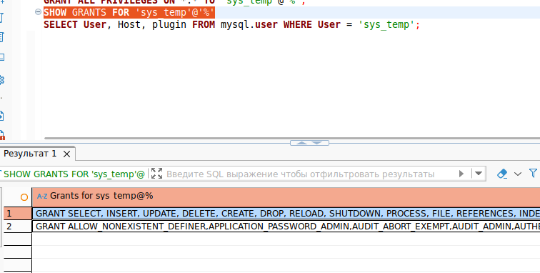  
1.6 Переподключимся к базе данных от имени sys_temp и проверим.  
`SELECT USER(), CURRENT_USER();`  
    
1.7 Скачать дамп базы данных посредством dbeaver не получилось, так как local client не cмог найти mysql 
в докере. Поэтому пришлось заталкивать дамп базы из хоста в докер, а затем загружать в mysql.  
`docker cp /home/yury/HW/SQL/DDL-DML/files/sakila-schema.sql  747aebd89200:/tmp/sakila-schema.sql  
 docker exec -it 747aebd89200 ls -la /tmp/  
 docker exec -it 747aebd89200 mysql -u sys_temp -p -e "CREATE DATABASE IF NOT EXISTS sakila;"  
 docker exec -it 747aebd89200 bash -c "mysql -u sys_temp -ppassword sakila < /tmp/dump.sql"`  
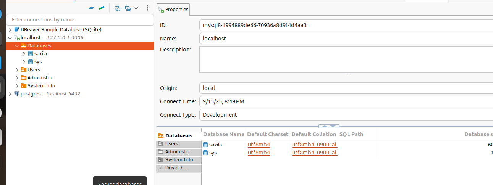   
1.8 Сформируем ER-диаграмму и, используя команду, выведем все таблицы базы данных.  
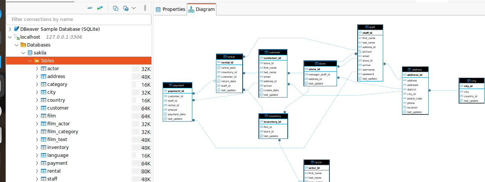  
`SHOW TABLES FROM sakila;`  
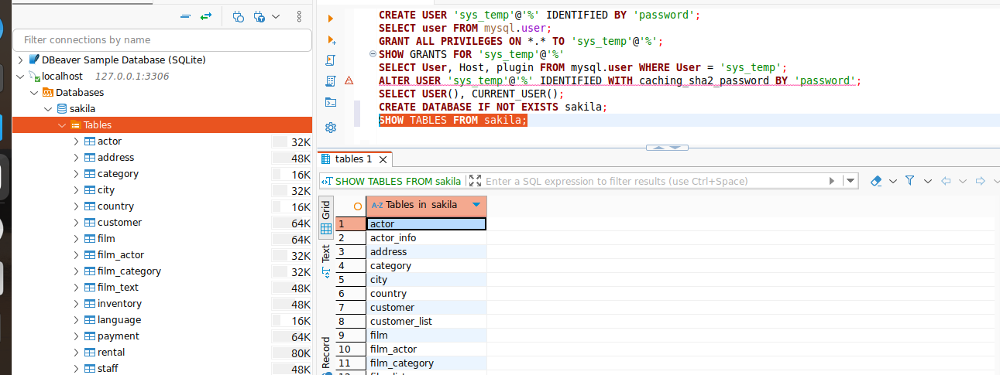  
Также загрузим данные.  
`docker cp /home/yury/HW/SQL/DDL-DML/files/sakila-data.sql 747aebd89200:/tmp/data.sql
docker cp /home/yury/HW/SQL/DDL-DML/files/sakila-data.sql 747aebd89200:/tmp/data.sql`
   

Простыня со всеми запросами.  
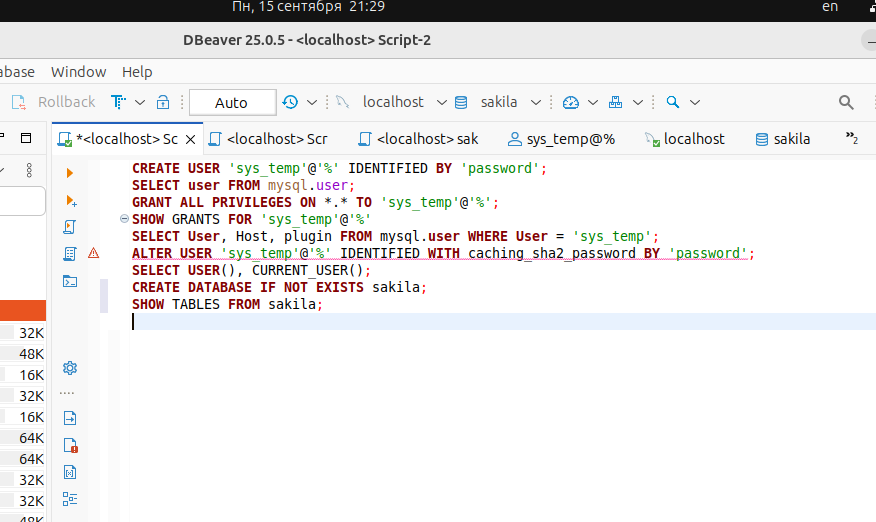  
---


### Задание 2
Составьте таблицу, используя любой текстовый редактор или Excel, в которой должно быть два столбца: в первом должны быть названия таблиц восстановленной базы, во втором названия первичных ключей этих таблиц. Пример: (скриншот/текст)
```
Название таблицы | Название первичного ключа
customer         | customer_id
```
---

#### Решение 2.
Получить данные можно визуальным изучением таблиц  
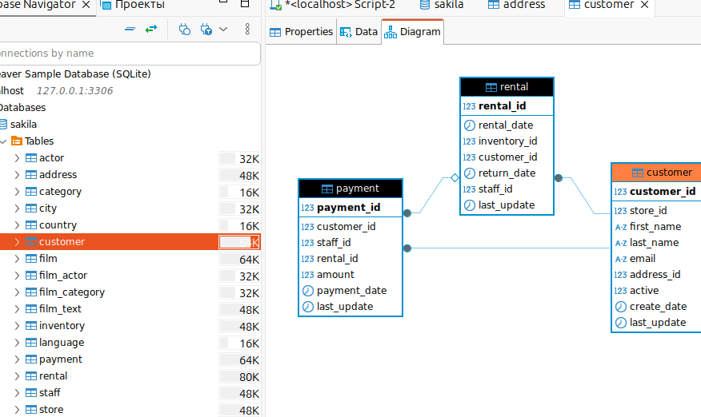   
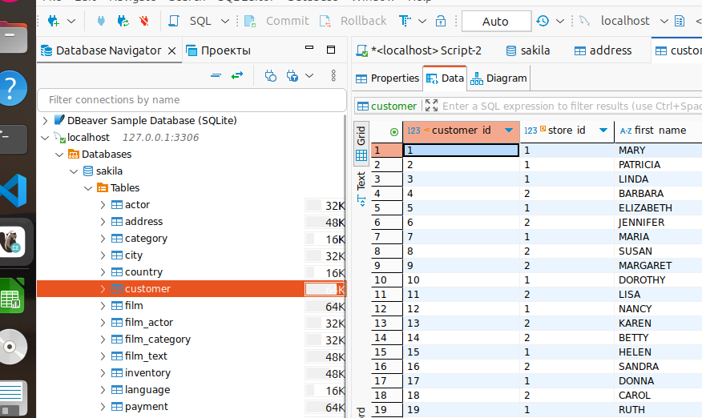   
или с помощью sql-скрипта  
`SELECT 
    t.TABLE_NAME,
    k.COLUMN_NAME AS PRIMARY_KEY,
    k.CONSTRAINT_NAME
FROM information_schema.TABLES t
LEFT JOIN information_schema.KEY_COLUMN_USAGE k 
    ON t.TABLE_SCHEMA = k.TABLE_SCHEMA 
    AND t.TABLE_NAME = k.TABLE_NAME 
    AND k.CONSTRAINT_NAME = 'PRIMARY'
WHERE t.TABLE_SCHEMA = 'sakila'
    AND t.TABLE_TYPE = 'BASE TABLE'
ORDER BY t.TABLE_NAME;`  
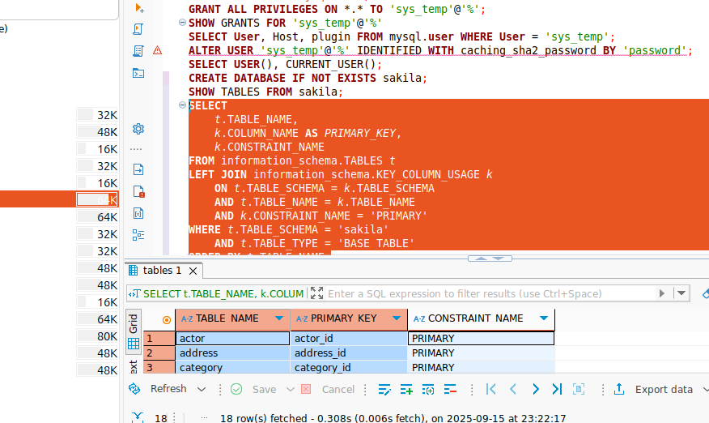

[файл в формате Excel](files/task_2.ods)
---


## Дополнительные задания (со звёздочкой*)
Эти задания дополнительные, то есть не обязательные к выполнению, и никак не повлияют на получение вами зачёта по этому домашнему заданию. Вы можете их выполнить, если хотите глубже шире разобраться в материале.

### Задание 3*
3.1. Уберите у пользователя sys_temp права на внесение, изменение и удаление данных из базы sakila.
3.2. Выполните запрос на получение списка прав для пользователя sys_temp. (скриншот)

*Результатом работы должны быть скриншоты обозначенных заданий, а также простыня со всеми запросами.*
---

#### Решение 3*.
Выдадим все права.    
`GRANT ALL PRIVILEGES ON sakila.* TO 'sys_temp'@'%';`    
Исключим права на модификацию.    
`REVOKE INSERT, UPDATE, DELETE ON sakila.* FROM 'sys_temp'@'%';`  
Применим изменения.    
`FLUSH PRIVILEGES;`  
Проверим права.  
`SHOW GRANTS FOR 'sys_temp'@'%';`  
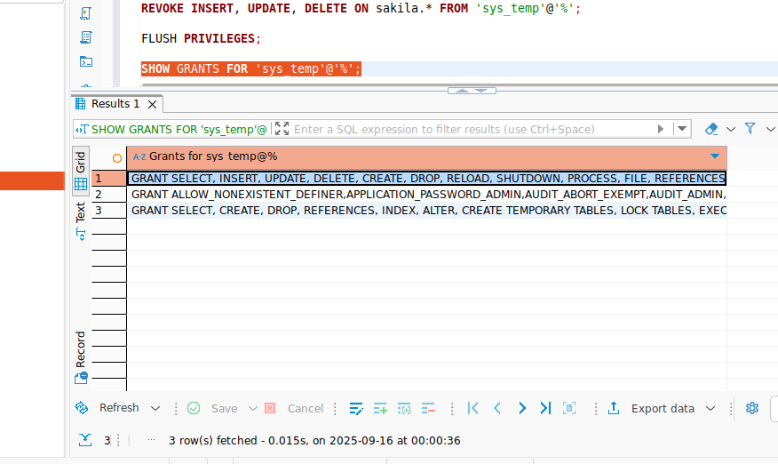  

---


